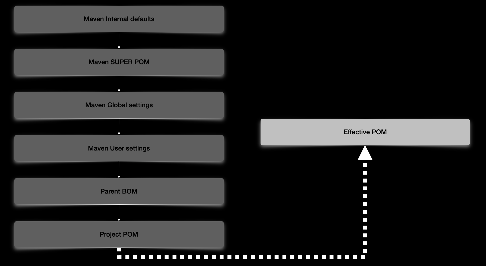

# Lesson 02

## Effective POM

## POM properties
Properties are the last required piece to understand POM basics. Maven properties are value placeholders, like properties in Ant. Their values are accessible anywhere within a POM by using the notation ${X}, where X is the property. Or they can be used by plugins as default values.

``mvn help:effective-pom -Dverbose``
