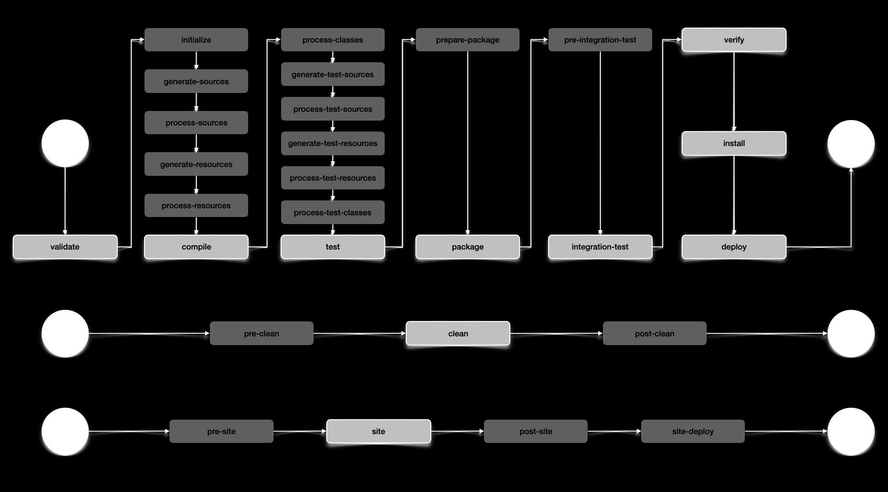

# Lesson 04

## Resources

## Lifecycle phases

Maven provides **standard lifecycles**.
Lifecycles have **Phases** that execute sequentially.
**Plugins** expose **Goals** that can be associated with phases _(or may simply be run independent of phases)._

